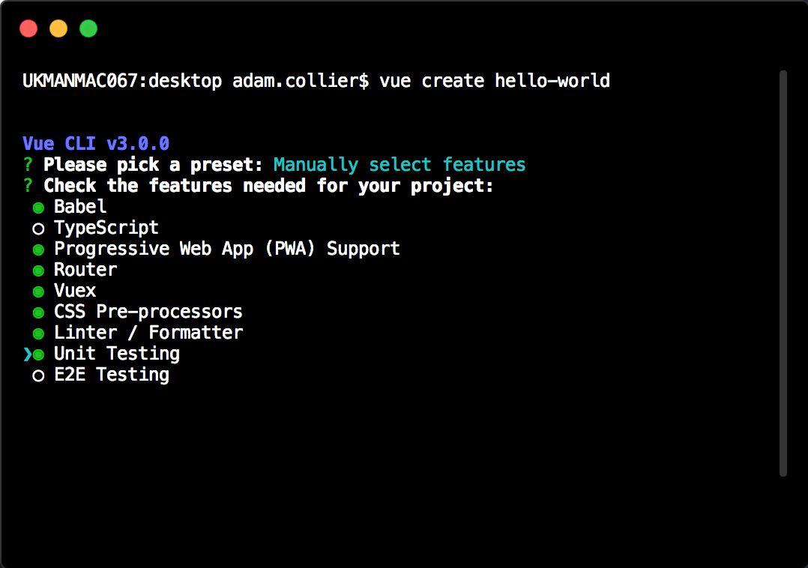

import { Head } from 'mdx-deck'

export { default as theme } from './theme'

<Head>
  <title>Vue Workshop</title>
</Head>

<!--  -->


## Intro to Vue 

---

## Install Vue CLI

```bash
npm install -g @vue/cli
# OR
yarn global add @vue/cli
```

---

## Now lets create a project

```bash 
cd desktop
vue create hello-world
```

---

## Select your settings



```notes
Features added:

Progressive Web App
Router
Vuex
CSS Pre-processors
Linter/Formatter
Unit Testing

At this point you can create a preset for your next project
```

---

## Now lets get stuck in

```bash
$ cd hello-world
$ npm run serve
```

useful plugins for VS Code: 
* Vetur
* Manta's Stylus Supremecy
* language-stylus

---

## main.js

```js
import Vue from "vue";
import App from "./App.vue";
import router from "./router";
import store from "./store";
import "./registerServiceWorker";

Vue.config.productionTip = false;

new Vue({
  router,
  store,
  render: h => h(App) 
}).$mount("#app");
```

```notes
We are attaching a Vue instance to the App element and rendering our App component (which is our homepage)

Notice how Vue CLI has added our router and store for us
```

---

## App.vue

```html
<template>
  <div id="app">
    <div id="nav">
      <router-link to="/">Home</router-link> |
      <router-link to="/about">About</router-link>
    </div>
    <router-view/>
  </div>
</template>
```

```notes
Vue router allows us to easily add routes

router-links are the href equivelent for vue router

router-view renders the matched component for the given path

lets take a look at our router.js

What I'd like you to do is create another route
```

---

# Creating another route

* Lets create Hello.vue in our views
* Create a template and add some content
* Add another object to the routes array in router.js
* In our App.vue add another router-link

```notes
git checkout adding_a_route
```

---

# Basic Component

### consists of three things:

* A HTML template
* Scripts
* Styles

Note: scripts and styles are optional

```notes 
git checkout basic_component
```

---

# Creating our first component

```notes 
Create a new vue file in our components directory (always in PascalCase)
Create a simple template

In our new view create script tags (we use export default instead of Vue.component) Utilises ES2015 module system

Import our component (@ is an alias for src)
Create a components object
Register our component

import MyFirstComponent from "@/components/MyFirstComponent";

components: {
  MyFirstComponent,
},

Add our component to our template
```

---

# Data in Vue

* When an instance is created it adds all of the data object properties to Vue's reactivity system
* When the data changes the view will re render 
* PROPERTIES ARE ONLY REACTIVE IF THEY EXISTED WHEN THE INSTANCE WAS CREATED

### Lets create a reactive component

```notes
git checkout reactive_component

create a new ButtonComponent in your components

<button @click="count++">You clicked me {{ count }} times.</button>

export default {
  data: function() {
    return {
      count: 0
    };
  }
};

data must be a function, so that each instance can maintain an independent copy

show example with simple data object
```

---

# Computed properties

* Allows us to write more complex logic
* Expects a value to be returned
* You don't have to call the function in the template
* Computed values are cached to avoid repetitively calculating a value that doesn't need to be re-calculated
* Valuable for manipulating data that already exists
* Re runs when it detects one of its dependencies has changed

```notes 
git checkout computed_properties

create a message property

add computed property

computed: {
  reversedMessage: function() {
    return this.message
      .split("")
      .reverse()
      .join("");
  }
}
```

---

# Methods

* Very similar to computed properties

* Don't cache their dependencies

* The function has to be called in the template

---

## Shorthand

```js
reversedMessage: function() {

}

// can also be written as

reversedMessage() {

}
```

---

# Conditional rendering

---

# v-if & v-else

* Allows us to conditionally render elements/components
* We can switch what is rendered by changing data values
* templates act as an invisible wrapper for multiple elements
* A v-else must directly follow a v-if element otherwise it wont be recognised

```notes 
git checkout v_if_else
```

---

# Lists

---

# v-for 

* Allows us to render a list of items based on an array
* v-for directive requires a special syntax, similar to javascripts for of
* Can also be used to loop over objects
* Optional second arguments for the index (arrays) and keys (objects)
* It is recommended to provide a key with v-for whenever possible

```notes
git checkout v_for

for Arrays
<p v-for="(item, index) in myList" :key="item.id">
  {{ index }}. {{ item }}
</p>

for Objects
<p v-for="(item, key, index) in myObject" :key="item.id">
  {{ index }}. {{ key }} {{ item }}
</p>
```

---

# What we haven't covered

* Props
* Events
* Lifecycle Hooks
* Prototypes
* Mixins

---

This deck was made with 
<https://github.com/jxnblk/mdx-deck>

Hosted on 
<https://zeit.co/now>

I will send this deck to everyone on slack

